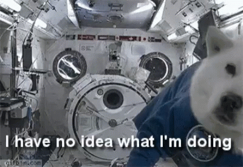
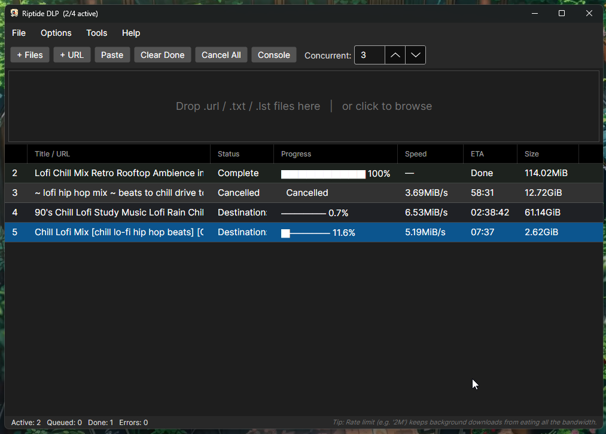

# Riptide DLP

**Are you tired of typing commands like some kind of wizard trapped in a terminal?**

Introducing **Riptide DLP**: the astonishing, life-enhancing, barely-believable cross-platform GUI wrapper for [yt-dlp](https://github.com/yt-dlp/yt-dlp) that lets you drop URLs in and get videos out!!!

That's right: it is a graphical interface for a tool that already does the hard part. Revolutionary? Perhaps. Convenient? Absolutely. Built with [Avalonia UI](https://avaloniaui.net/) + .NET 8, because apparently buttons need infrastructure.


---

<p align="center">
  
</p>

<p align="center"><em>The author, moments before shipping an unstoppable productivity appliance.</em></p>

---

## But Wait, There Are Prerequisites!!!

Riptide DLP is a GUI wrapper, which means it proudly delegates the actually difficult work to external tools, like any respectable middle manager.

You will need these tiny little miracle engines installed:

| Tool | Required? | What it does |
|---|---|---|
| [yt-dlp](https://github.com/yt-dlp/yt-dlp/releases) | **Required** | The actual downloader. Without this, Riptide DLP becomes a premium-grade URL appreciation station. |
| [FFmpeg](https://ffmpeg.org/download.html) | **Required** | Merges video and audio streams because YouTube loves shipping them separately, like a puzzle you didn't ask for. Also handles thumbnails, subtitles, and conversions. |
| [Node.js](https://nodejs.org/) | Optional | Helps solve YouTube's JavaScript challenge for trickier URLs. Optional in the same way an umbrella is optional during a storm. |

> **Incredible convenience alert:** Riptide DLP checks for these automatically on first launch and politely complains if anything is missing. You can summon this thrilling diagnostic extravaganza any time from **Help → Prerequisites**.

### Quick Install, Because Nobody Has Time

**Windows, using winget, the command-line shopping cart:**
```powershell
winget install yt-dlp.yt-dlp
winget install Gyan.FFmpeg
winget install OpenJS.NodeJS
```

**macOS, using Homebrew, because of course:**
```bash
brew install yt-dlp ffmpeg node
```

**Linux, where you already knew this was coming:**
```bash
sudo apt install ffmpeg nodejs        # FFmpeg + Node from apt
pip install yt-dlp                    # yt-dlp from pip, because newer is usually better
```

Make sure all three tools are on your `$PATH`. Riptide DLP looks for `yt-dlp`, `ffmpeg`, and `node` by name, because telepathy support missed the release window.
>  (but it probably still didn't beat the light, so feel free to bump tunes and make faces at it so it wonders if the gas was worth it)
---

## Installation

Pre-built self-contained binaries are available on the [**Releases page**](https://github.com/quietlydismantled/riptide-dlp/releases). No .NET runtime required!!! Just extract and go, like software in a commercial where nobody has permissions issues.

| Platform | File |
|---|---|
| Windows x64 | `riptide-dlp-vX.Y.Z-windows.zip` |
| Linux x64 | `riptide-dlp-vX.Y.Z-linux.tar.gz` |
| macOS x64 (Intel) | `riptide-dlp-vX.Y.Z-macos-x64.tar.gz` |
| macOS ARM64 (Apple Silicon) | `riptide-dlp-vX.Y.Z-macos-arm64.tar.gz` |

**Windows:** Extract the zip, double-click `RiptideDlp.exe`, and behold: a window.

**Linux:**
```bash
tar -xzf riptide-dlp-*.tar.gz
chmod +x RiptideDlp
./RiptideDlp
```

**macOS:**
```bash
tar -xzf riptide-dlp-*.tar.gz
chmod +x RiptideDlp
# First run only — remove the quarantine flag if macOS clutches its pearls:
xattr -d com.apple.quarantine ./RiptideDlp
./RiptideDlp
```

---

## Quick Start: Four Steps to Unthinkable Luxury

1. Drop `.url`, `.txt`, or `.lst` files onto the **drop zone**. One URL per line in text files, **because modern civilization has rules**.
2. Or **click the drop zone** to browse for files, for those who prefer clicking rectangles.
3. Or use **`+ Files`**, **`+ URL`**, or **Paste** in the toolbar to add URLs directly. We have options!!!
4. Downloads start automatically, up to N at a time, configurable in the toolbar or **Options**. Because sometimes one video at a time is simply too medieval.

---

## Screenshots: OH YEAH, LOOK AT THIS MAGNIFICENT UI!!!

Behold: a window!!! Not just any window. A window with a **big drop box**.

<p align="center">
  
</p>

<p align="center"><em>The drop zone: large enough to be seen from orbit, probably.</em></p>

Drop a link from your browser's URL field? **Yeah buddy.**

A `.url` file from your desktop? **Absolutely.**

A lovingly hand-crafted `.lst` or `.txt` file containing one URL per line? **Now you're operating at peak automation excellency.**

A **meticulously curated printed copy of every cat video URL in existence thrown from a four-story fire escape**?

...well, maybe, if you have incredible aim.

And if your work's vision insurance is terrible and you somehow can't drag something into a drop box the size of a football field, there's more good news!!! Thanks to modern UI frameworks and possible coding oversight, you can probably just drag it **somewhere else in the UI** and it will still get added to the download queue anyway.

Probably.

If it doesn't, just try again. Just, Somewhere different this time.

> **Disclaimer:** I have not tested every pixel of the UI, because there are only so many hours in a day and only so much coffee in the bloodstream. Bug reports are welcome.

---

## Features You Probably Could Live Without, But Why Risk It?

### Adding URLs, Now With Multiple Human-Compatible Rituals

Riptide DLP accepts URLs through several paths. Choose your favorite method of telling a computer where the video lives:

| Method | How |
|---|---|
| **Drag & drop files** | Drop `.url`, `.txt`, or `.lst` files onto the drop zone. Each line in a text file becomes one download. That's right: lines become tasks. Science marches on. |
| **Drag & drop URLs** | Drag a URL string, such as from a browser address bar, directly onto the drop zone. The future is sticky. |
| **`+ Files` / `Ctrl+O`** | Opens a file picker with multi-select. Accepts `.url`, `.txt`, `.lst`, and all files, because confidence is attractive. |
| **`+ URL` / `Ctrl+U`** | Opens a dialog where you can type or paste one or more URLs, like writing a grocery list for robots. |
| **Paste / `Ctrl+V`** | Reads your clipboard and imports any URLs it finds. Finally, your clipboard has purpose. |

All sources split on newlines automatically. Blank lines and exact duplicates are silently ignored, because not every mistake deserves a conversation.

---

### The Download Queue: A Table, But Make It Dramatic

The main table shows all downloads with live-updating columns, because staring at progress bars is a lifestyle:

| Column | What it shows |
|---|---|
| **#** | Sequential ID. Numbers!!! |
| **Title / URL** | Video title from metadata, or the URL if the title is still emotionally unavailable. |
| **Status** | Current download state, so you can know whether to celebrate or sigh. |
| **Progress** | ASCII progress bar plus percentage. Retro charm meets modern impatience. |
| **Speed** | Current transfer speed. Watch the bytes sprint, jog, or take a nap. |
| **ETA** | Estimated time remaining, also known as a tiny fortune cookie for your bandwidth. |
| **Size** | File size. Big number means big video. Probably. |

Row background colors reflect download state at a glance:

- Neutral — queued
- Blue — downloading
- Green — complete
- Red — error
- Grey — cancelled

Column widths are resizable and saved between sessions, because your column-width opinions are valid and deserve persistence.

---

### Row Actions: Because Right-Clicking Should Feel Powerful

| Action | How to do it |
|---|---|
| **Open downloaded file** | Double-click a row. Yes, the ancient ritual still works. |
| **Open output folder** | Right-click → *Open output folder*. Find your treasure hoard. |
| **Cancel** | Right-click → *Cancel*. Assert dominance over the queue. |
| **Retry** a failed/cancelled item | Right-click → *Retry*. Maybe this time the internet behaves. |
| **Remove** from list | Right-click → *Remove*, or press `Delete`. Dramatic disappearance included. |
| **Copy URL** to clipboard | Right-click → *Copy URL*. For when one clipboard-based adventure leads to another. |

You can multi-select rows with `Shift+Click` or `Ctrl+Click`. Press `Delete` to remove all selected rows at once, a bulk productivity feature previously thought impossible by several imaginary experts.

---

### Console Panel: For When the Magic Stops Being Magic

The Console panel shows raw yt-dlp output, which is useful for debugging errors, observing the machinery, or pretending you totally understand what just happened.

- Toggle it with the **Console** button in the toolbar
- Drag the **splitter** between the queue and console to resize it
- **Select a row** in the download queue to filter the console to that download's output only
- Deselect by clicking empty space to see all output

It is like lifting the hood of a car, except the car is Python-adjacent and occasionally mad at YouTube.

---

### Toolbar: Buttons, Now in a Row!!!

| Button | Action |
|---|---|
| **+ Files** | Add files with a file picker. Absolutely dazzling. |
| **+ URL** | Add URLs via dialog. A rectangle where links go. |
| **Paste** | Import URLs from clipboard. Clipboard synergy!!! |
| **Clear Done** | Remove completed and errored items from the list. Declutter with one click. |
| **Cancel All** | Cancel all running and queued downloads. The big red button, spiritually speaking. |
| **Console** | Toggle the console panel. Reveal the cryptic scroll. |
| **Concurrent ↑↓** | Set how many downloads run in parallel, from 1–16. Parallelism: now with arrows. |

---

### Keyboard Shortcuts, for Elite Rectangle Avoidance

| Shortcut | Action |
|---|---|
| `Ctrl+O` | Add files with the file picker |
| `Ctrl+U` | Open the Add URL dialog |
| `Ctrl+V` | Paste URLs from clipboard |
| `Delete` | Remove selected row(s) from the list |

---

### Menus: Because Every App Needs Places to Hide Things

**File**
- Add Files… (`Ctrl+O`)
- Add URL… (`Ctrl+U`)
- Exit

**Options**
- Settings… — opens the full Options dialog
- Dark mode — toggle theme, because retinas are apparently optional
- Open output folder — opens the configured download directory

**Tools**
- Update yt-dlp — downloads the latest yt-dlp binary
- Kill all yt-dlp processes — the emergency eject handle for runaway downloads

**Help**
- Prerequisites… — shows the tool check dialog
- About — because identity matters

---

### Options Dialog: Tune the Machine You Barely Had to Build

Open from **Options → Settings…** and prepare to witness configurable abundance.

| Setting | Default | Notes |
|---|---|---|
| **Concurrent downloads** | 3 | Also adjustable in the toolbar. Range: 1–20. More downloads, more chaos. |
| **Output directory** | `~/Videos` | Where downloaded files are saved. Browse button included, because typing paths is a cry for help. |
| **Format string** | `bestvideo+bestaudio/best` | yt-dlp format selector. Drop-down includes common presets; fully editable for those who speak fluent incantation. |
| **Rate limit** | *(none)* | Throttle download speed. Examples: `2M` for 2 MB/s, `500K` for 500 KB/s. Be kind to your network, allegedly. |
| **Cookies from browser** | *(none)* | Pull cookies from a running browser such as Chrome, Firefox, or Edge for age-restricted or logged-in content. Delicious and mildly alarming. |
| **Cookie file (.txt)** | *(none)* | Path to a Netscape-format cookie export file. Alternative to browser cookies. Vintage web cuisine. |
| **JS runtime** | `node` | JavaScript runtime for YouTube's n-challenge. `node` is recommended; `deno` also works if you're feeling spicy. |
| **YouTube player client** | *(none)* | Override the player client string passed to YouTube. Leave blank unless you know what you're doing, which is a brave sentence in software. |
| **Subtitle languages** | `en` | Comma-separated BCP-47 language tags, such as `en,es,fr`. Used when *Write subtitles* is on. |
| **Extra yt-dlp flags** | *(none)* | Additional flags appended verbatim to every yt-dlp call. With great power comes great opportunity to typo. |
| **Audio only** | off | Extracts audio and saves as MP3. Requires FFmpeg, the tireless backstage goblin. |
| **Skip existing files** | on | Passes `--no-overwrites`; avoids re-downloading files that already exist. Memory! Restraint! Growth! |
| **Ignore errors** | on | Continues a playlist even if individual items fail. Emotional resilience, automated. |
| **Embed thumbnail** | off | Embeds the video thumbnail as album art. Requires FFmpeg. Album art: because files need outfits. |
| **Write subtitles** | off | Downloads and saves subtitles in the configured languages. Reading: now adjacent to videos. |
| **SponsorBlock** | off | Automatically removes sponsor segments using the [SponsorBlock](https://sponsor.ajay.app/) database. The skip button, but outsourced to society. |
| **Dark mode** | on | Toggleable here or from the Options menu. Darkness, managed. |

Settings are saved to:

- **Windows:** `%APPDATA%\riptide-dlp\settings.json`
- **Linux / macOS:** `~/.config/riptide-dlp/settings.json`

Yes, your preferences survive restarts. Truly, we live in an age of wonders.

---

### Prerequisites Dialog: The Tiny Inspector General

Available from **Help → Prerequisites…**, and also launched automatically on startup if anything required is missing.

It shows the install status and detected version of yt-dlp, FFmpeg, and Node.js. Each entry has a **Get it →** button that opens the official download page, because hunting through search results builds character but wastes time.

Hit **Re-check** after installing a tool to update the status without restarting the app. That's right: feedback loops!!!

---

## Build from Source, You Magnificent Overachiever

Requires the [**.NET 8 SDK**](https://dotnet.microsoft.com/download/dotnet/8.0). No other global tools needed, because restraint briefly visited the project.

```bash
git clone https://github.com/quietlydismantled/riptide-dlp.git
cd riptide-dlp
dotnet build RiptideDlp.sln
dotnet run --project src/RiptideDlp
```

**Self-contained single-file publish**, for when you want a neat little deployable lump. Replace `win-x64` with your target RID:

```bash
dotnet publish src/RiptideDlp -c Release -r win-x64 \
  --self-contained true \
  -p:PublishSingleFile=true \
  -o out/win-x64
```

Available RIDs:

- `win-x64`
- `linux-x64`
- `osx-x64`
- `osx-arm64`

**Tag-based releases** are handled automatically by GitHub Actions. Push a `v*` tag and it builds all four platforms and creates a Release with attached binaries. Because nothing says "professional software operation" like a robot zip factory.

---

## FAQ / Troubleshooting, Also Known as "The Internet Happened"

**"yt-dlp not found" on startup**  
Install yt-dlp and make sure it is on your `PATH`. On Windows, you can also drop `yt-dlp.exe` in the same folder as `RiptideDlp.exe`, which is not elegant, but neither is reality.

**Video downloads fine but there is no audio, or vice versa**  
FFmpeg is required to merge the separate video and audio streams YouTube delivers. Install it and re-check via **Help → Prerequisites**. The app cannot merge vibes.

**YouTube n-challenge / `nsig` errors**  
Install Node.js. It is listed as optional, but YouTube increasingly requires it for higher-quality streams, because apparently URLs now come with riddles.

**Age-restricted or members-only content fails**  
Set **Cookies from browser** in Options to your logged-in browser, or export a cookie file and point the **Cookie file** setting at it. Riptide DLP cannot log into your life by itself, which is probably for the best.

**Download is stuck at 0% with no visible progress**  
Open the Console panel and select the stuck row. The raw yt-dlp output will usually explain what went wrong, often in the tone of a printer error from 2003.

**"Clear Done" does not remove a cancelled item**  
It should. Clear Done removes completed, errored, and cancelled items. If a partial file such as `.part` or `.ytdl` was left behind, it is deleted along with the entry. Tidiness!!!

**Linux: app will not launch**  
Make sure the binary has execute permission:

```bash
chmod +x RiptideDlp
```

**macOS: "cannot be opened because the developer cannot be verified"**  
Either right-click → Open the first time, or strip the quarantine attribute:

```bash
xattr -d com.apple.quarantine ./RiptideDlp
```

macOS is simply protecting you from the terrifying concept of software you intentionally downloaded.

---

## Final Pitch

Riptide DLP: the unbelievably convenient, mildly dramatic, aggressively clickable way to ask yt-dlp and FFmpeg to do what they were already very good at doing!!!

Drop URLs in. Get videos out. Pretend this needed a product launch.

And in case it wasn't painfully obvious, this started as a joke project (and still very much is) built out of necessity. hope someone else on the interwebs finds it useful (or at least gets a laugh out of the the readme) Happy Ripping folks 😂
